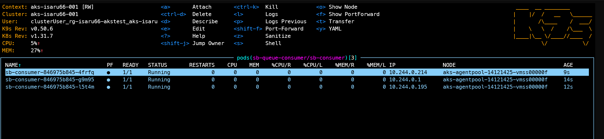

# Azure Service Bus RBAC Testing

This repository demonstrates how to test Azure Service Bus with Role-Based Access Control (RBAC) and provides guidance for cost management and chargeback scenarios.

## 📋 Table of Contents

- [Overview](#overview)
- [Prerequisites](#prerequisites)
- [Project Structure](#project-structure)
- [Azure RBAC Configuration](#azure-rbac-configuration)
- [Sample Applications](#sample-applications)
- [Cost Management & Chargeback](#cost-management--chargeback)
- [Testing Scenarios](#testing-scenarios)
- [Deployment](#deployment)
- [Troubleshooting](#troubleshooting)

## 🔍 Overview

This project provides:
- **Producer Sample**: Spring Boot application that sends messages to Azure Service Bus
- **Consumer Sample**: Spring Boot application that receives messages from Azure Service Bus
- **RBAC Configuration**: Comprehensive guide for setting up role assignments at different scopes
- **Cost Management**: Strategies for tracking and allocating Service Bus costs

## 🛠️ Prerequisites

- Java 21+
- Maven 3.6+
- Azure CLI 2.0+
- Docker (optional, for containerized deployment)
- Azure Subscription with appropriate permissions

## 📁 Repo Structure

```
├── README.md
├── docs/
│   └── images/
├── sample-code/
│   ├── azure-servicebus-consumer-sample/
│   │   ├── src/main/java/com/isaru66/azure_servicebus_sample/
│   │   ├── dockerfile
│   │   ├── k8s/deployment.yaml
│   │   └── pom.xml
│   └── azure-servicebus-producer-sample/
│       ├── src/main/java/com/isaru66/azure_servicebus_sample/
│       ├── dockerfile
│       ├── k8s/deployment.yaml
│       └── pom.xml
```

## 🚀 Service Bus Overview
Azure Service Bus is a fully managed enterprise message broker service that enables reliable communication between various components and services. Here's a high-level overview of the architecture:


Azure Service Bus offers two messaging patterns:
- **Queue-based**: Point-to-point communication model
- **Topic-based**: Publish/subscribe model with multiple subscribers

Each pattern supports:
- Advanced message handling
- Message sessions
- Partitioning
- Transaction support
- Dead-lettering

## 🔐 Azure RBAC Configuration

### Service Bus Built-in Roles

| Role | Description | Permissions |
|------|-------------|-------------|
| **Azure Service Bus Data Owner** | Full access to Service Bus resources | Send, receive, manage entities |
| **Azure Service Bus Data Sender** | Send messages only | Send messages to queues/topics |
| **Azure Service Bus Data Receiver** | Receive messages only | Receive messages from queues/subscriptions |

The following list describes the levels at which you can scope access to Service Bus resources, starting with the narrowest scope: 

- **ServiceBus Topic Subscription**: At this scope, role assignment applies only to this entity. Currently, the Azure portal doesn't support assigning an RBAC role to a security principal at this level, but you can use other tooling to do the same. 
- **ServiceBus Topic**: Role assignment applies to a specific Topic and the Subscriptions under it. 
- **ServiceBus Queue**: Role assignment applies to a specific Queue.
- **ServiceBus Namespace**: Role assignment spans the entire topology of Service Bus under the namespace and to the queues, topics and subscriptions associated with it. 
Resource group: Role assignment applies to all the Service Bus resources under the resource group. 
- **Azure Subscription**: Role assignment applies to all the Service Bus resources in all of the resource groups in the subscription. Please note that this is the 'Azure Subscription' and is different from the 'Subscription' that exists within the context of a 'Topic'.

**Important**: Role assignments at broader scopes (like subscription level) take precedence over and override assignments at narrower scopes (like queue level). For example, if a user has "Data Owner" at the namespace level, they will have full access regardless of any restrictive roles assigned at the queue level.

### 1. Namespace Level RBAC

Assign roles at the Service Bus namespace level for broad access:

```bash
# Get your Service Bus namespace resource ID
NAMESPACE_ID=$(az servicebus namespace show \
  --name "your-namespace" \
  --resource-group "your-rg" \
  --query id -o tsv)

# Assign Data Sender role to a user/service principal
az role assignment create \
  --assignee "user@domain.com" \
  --role "Azure Service Bus Data Sender" \
  --scope "$NAMESPACE_ID"

# Assign Data Receiver role to a different user/service principal
az role assignment create \
  --assignee "receiver@domain.com" \
  --role "Azure Service Bus Data Receiver" \
  --scope "$NAMESPACE_ID"

# Assign Data Owner role for full access
az role assignment create \
  --assignee "admin@domain.com" \
  --role "Azure Service Bus Data Owner" \
  --scope "$NAMESPACE_ID"
```

### 2. Queue Level RBAC

For fine-grained access control on specific queues:

```bash
# Get queue resource ID
QUEUE_ID=$(az servicebus queue show \
  --namespace-name "your-namespace" \
  --name "your-queue" \
  --resource-group "your-rg" \
  --query id -o tsv)

# Assign role to specific queue
az role assignment create \
  --assignee "queue-user@domain.com" \
  --role "Azure Service Bus Data Sender" \
  --scope "$QUEUE_ID"
```

### 3. Topic Level RBAC

Control access to specific topics:

```bash
# Get topic resource ID
TOPIC_ID=$(az servicebus topic show \
  --namespace-name "your-namespace" \
  --name "your-topic" \
  --resource-group "your-rg" \
  --query id -o tsv)

# Assign sender role to topic
az role assignment create \
  --assignee "topic-sender@domain.com" \
  --role "Azure Service Bus Data Sender" \
  --scope "$TOPIC_ID"
```

### 4. Topic Subscription Level RBAC

Most granular control at subscription level:

```bash
# Get subscription resource ID
SUBSCRIPTION_ID=$(az servicebus topic subscription show \
  --namespace-name "your-namespace" \
  --topic-name "your-topic" \
  --name "your-subscription" \
  --resource-group "your-rg" \
  --query id -o tsv)

# Assign receiver role to subscription
az role assignment create \
  --assignee "subscription-receiver@domain.com" \
  --role "Azure Service Bus Data Receiver" \
  --scope "$SUBSCRIPTION_ID"
```

## 🚀 Sample Applications

### Producer Application

Located in `sample-code/azure-servicebus-producer-sample/`

**Key Features:**
- Sends messages to Service Bus topics/queues
- Uses Managed Identity for authentication
- Configurable entity type (queue/topic)

**Configuration:**
```properties
spring.cloud.azure.servicebus.namespace=${AZURE_SERVICEBUS_NAMESPACE}
spring.cloud.azure.servicebus.entity-name=${AZURE_SERVICEBUS_QUEUE}
spring.cloud.azure.servicebus.entity-type=${AZURE_SERVICEBUS_ENTITY_TYPE}
```

The same application code can be use to produce on both QUEUE and TOPIC

**Running the Producer:**
```bash
cd sample-code/azure-servicebus-producer-sample
mvn spring-boot:run
```

### Consumer Application

Located in `sample-code/azure-servicebus-consumer-sample/`

**Key Features:**
- Receives messages from Service Bus topics/queues
- Supports subscription-based consumption for topics
- Uses Managed Identity for authentication

**Configuration:**
```properties
spring.cloud.azure.servicebus.namespace=${AZURE_SERVICEBUS_NAMESPACE}
spring.cloud.azure.servicebus.entity-name=${AZURE_SERVICEBUS_QUEUE}
spring.cloud.azure.servicebus.entity-type=${AZURE_SERVICEBUS_ENTITY_TYPE}
spring.cloud.azure.servicebus.subscription-name=${AZURE_SERVICEBUS_SUBSCRIPTION_NAME}
```

The same application code can be use to consume from both QUEUE and TOPIC-subscription

**Running the Consumer:**
```bash
cd sample-code/azure-servicebus-consumer-sample
mvn spring-boot:run
```

## 💰 Cost Management & Chargeback

### Understanding Service Bus Pricing

To be discuss

Azure Service Bus costs are based on:
- **Messaging Operations**: Number of messages sent/received
- **Brokered Connections**: Number of concurrent connections
- **Relay Hours**: For hybrid connections (if used)


## 🧪 Testing Scenarios

### RBAC Testing Scenarios


#### To setup Workload Identity
You can refer to the full guide [here](https://learn.microsoft.com/en-us/azure/aks/workload-identity-deploy-cluster)

- Get AKS ODIC issuer
```
AKS_OIDC_ISSUER="$(az aks show --name "${CLUSTER_NAME}" \
    --resource-group "${RESOURCE_GROUP}" \
    --query "oidcIssuerProfile.issuerUrl" \
    --output tsv)"
```

- Go to user manage identity, then federate Identity to Kubernete Service Account


- Select Federate to `Kubernetes Accessing Azure Resource`


- Add AKS_ODIC issuer, namespace, service account that you want to link with this user identity


- In Kubernete, 
ensure that your AKS cluster have ODIC enable and Workload identity enable
create service account in the above namespace
```
# Service Account - with azure.workload.identity/client-id annotation
apiVersion: v1
kind: ServiceAccount
metadata:
  annotations:
    azure.workload.identity/client-id: "cb22d1f1-e114-4f25-a4a2-ed15a8e5accc" # UMI Client ID
  name: "sa-sb-queue-producer"
  namespace: "sb-queue-producer"
```
in deployment spec, add label `azure.workload.identity/use: "true"`
```
  template:
    metadata:
      labels:
        azure.workload.identity/use: "true"  # Required for WorkloadIdentity. Only pods with this label can use workload identity.
```

#### Scenario 1: Queue Normal Case
- **Producer App**: Has `Azure Service Bus Data Sender` role on queue-1
- **Consumer App**: Has `Azure Service Bus Data Receiver` role on queue-1
- **Test**: Everything should success as every service have required permission.

##### Result
Producer


Consumer


#### Scenario 2: Queue Scaled Consumer
- **Producer App**: Has `Azure Service Bus Data Sender` role on queue-1
- **Consumer App**: Has `Azure Service Bus Data Receiver` role on queue-1, Scale Consumer App to 3 pod and see message distribution
- **Test**: Everything should success as every service have required permission.

##### Result
Consumer scale to 3 Pod


Consumer result

In this case, the queue was partitioned into 2 segments. We can observe that messages are distributed across all 3 pods in sequential order, demonstrating effective load balancing of message processing.

#### Scenario 3: Queue Error case
- **Producer App**: Has `Azure Service Bus Data Sender` role on queue-1, but set environment variable to access queue-2
- **Consumer App**: Has `Azure Service Bus Data Receiver` role on queue-1, but set environment variable to access queue-2
- **Test**: Azure should show access denined error for both **Producer App** and **Consumer App**

##### Result
Producer


Consumer


#### Scenario 4: Topic Normal Case
- **Producer App**: Has `Azure Service Bus Data Sender` role on topic-1
- **Consumer App**: Has `Azure Service Bus Data Receiver` role on topic-1/subscription-1
- **Test**: Everything should success as every service have required permission.

##### Result
Producer


Consumer


note that for subscription-1, we also add filter to show only message with color red.


#### Scenario 5: Topic Error case
- **Producer App**: Has `Azure Service Bus Data Sender` role on topic-1, but set environment variable to access topic-2
- **Consumer App**: Has `Azure Service Bus Data Receiver` role on topic-1/subscription-1, but set environment variable to access topic-1/subscription-2
- **Test**: Azure should show access denined error for both **Producer App** and **Consumer App**

##### Result
Producer


Consumer


## 🐳 Deployment

### Docker Deployment

Build and run the applications using Docker:

```bash
# Build producer
cd sample-code/azure-servicebus-producer-sample
mvn package -DskipTests
docker buildx build . --platform="linux/amd64,linux/arm64" -t isaru66/springboot-azure-servicebus-producer  --push 

# Build consumer
cd ../azure-servicebus-consumer-sample
mvn package -DskipTests
docker buildx build . --platform="linux/amd64,linux/arm64" -t isaru66/springboot-azure-servicebus-consumer  --push 

# Run with environment variables
docker run -e AZURE_SERVICEBUS_NAMESPACE="your-namespace.servicebus.windows.net" \
           -e AZURE_SERVICEBUS_QUEUE="queue-1" \
           -e AZURE_SERVICEBUS_ENTITY_TYPE="queue" \
           -p 8080:8080 \
           isaru66/springboot-azure-servicebus-producer
```

### Kubernetes Deployment

Deploy to AKS using the provided manifests in `k8s/` directories:

```bash
# Apply producer deployment
kubectl apply -f sample-code/azure-servicebus-producer-sample/k8s/queue-deployment.yaml

# Apply consumer deployment
kubectl apply -f sample-code/azure-servicebus-consumer-sample/k8s/queue-deployment.yaml
```

Adjust pod template spec's environment variable section to change behavior

```bash
apiVersion: apps/v1
kind: Deployment
...
spec:
  ...
  template:
    spec:
      serviceAccountName: sa-sb-queue-consumer
      containers:
      - name: sb-consumer
        image: isaru66/springboot-azure-servicebus-consumer:latest
        imagePullPolicy: IfNotPresent
        resources:
          requests:
            cpu: 100m
            memory: 100Mi
          limits:
            cpu: 1000m
            memory: 1Gi
        env:
        - name: AZURE_SERVICEBUS_QUEUE
          value: "queue-1"
        - name: AZURE_SERVICEBUS_ENTITY_TYPE
          value: "queue"
        ports:
        - containerPort: 8080
          name: sb-consumer
      restartPolicy: Always
```
